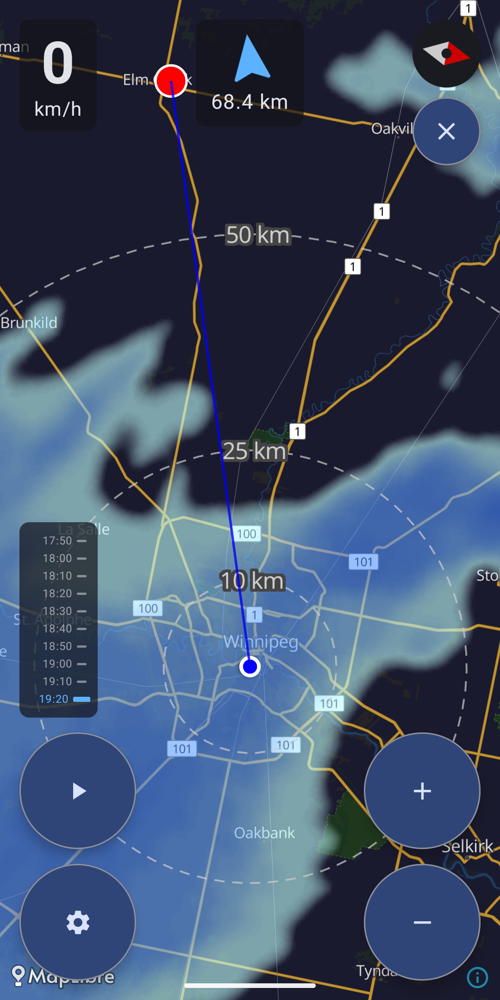

# Road Trip Radar

Weather radar display ahead of your current direction! Pretend you're an airplane with weather radar on board, and weave between those thunder heads! Intended mostly for motorcycle travel, but may be useful for you on any journey.

[Latest Releases](https://github.com/digiexchris/RoadTripRadar/releases)

# Features

- Rotates the map to follow your change in heading
- Updates the weather map in 1 minute intervals (note: RainViewer provides maps in 10 minute increments)
- Has ZERO trackers, not even to tell me how many people are using this! Spyware free! Though location access and internet access permissions will be requested the first time you run the app, because it needs to use your GPS to operate the map, and use hte internet to download the weather. But none of that gets sent back to me. What gets retrieved from Rainviewer, the base map providers, and your GPS remain on your device, and are deleted when you uninstall.

- Light and dark maps
- Weather radar history playback
- Search for a name, address, or a point of interest by category. Searches the currently visible map area.
- Touch and hold to set a custom POI to navigate to.

Zoom in/Zoom out
- Changes current zoom, but doesn't affect heading tracking.

# Developnent

## Prerequisites

- Android Studio
- Android SDK (API 26+)

## Permissions

The app requires:
- `ACCESS_FINE_LOCATION` - High-accuracy GPS
- `ACCESS_COARSE_LOCATION` - Network-based location
- `INTERNET` - Map tiles and radar data

## License

This project is licensed under the [MIT License](LICENSE).

## Credits

- MapLibre & OpenFreeMap
- RainViewer

