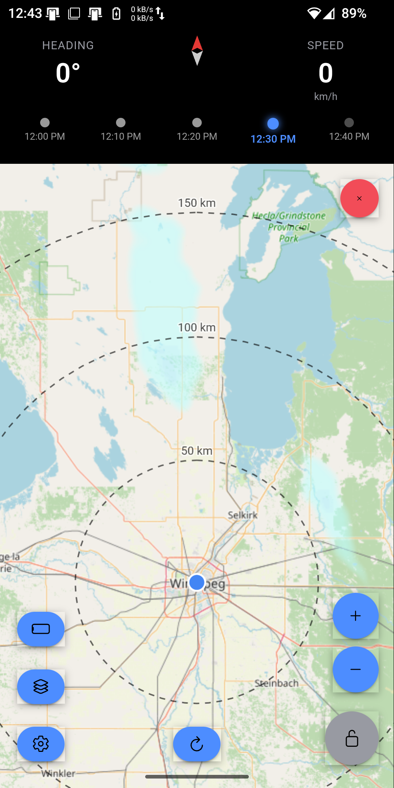

# Road Trip Radar

Weather radar display ahead of your current direction! Pretend you're an airplane with weather radar on board, and weave between those thunder heads! Intended mostly for motorcycle travel, but may be useful for you on any journey.

[Latest Releases](https://github.com/digiexchris/RoadTripRadar/releases)

# Features

Layers button
- Light and dark base maps
- Light and dark range circles
- Turn off range circles, weather radar, or base maps
- Change opacity of the weather radar

Settings button
- Default Zoom Level (0–18)
- Radar History Frames (1–10, how many past frames to animate)
- Animation Speed (0.5–5.0s per frame)
- Movement Threshold (5–50m, distance before switching from compass to GPS heading)
- Motion Detection Sensitivity (1–5, how quickly it detects movement vs stationary)
- Speed Unit (km/h or mph)
- Compass Rotation toggle (rotate map via compass when stationary)
- Keep Screen On toggle
- Map Center Position (10–90%, how far ahead of your location the map shows)
- Default Orientation (Portrait or Landscape)
- Default Radar Mode (History/Animated or Current Only)
- Reset to Defaults
- View Terms & Conditions

Landscape/Portrait button
- Guess

Zoom in/Zoom out
- Changes current zoom, but doesn't affect heading tracking.

Lock button
- Unlock to allow you to manually move/reorient the map. Hit the lock button again to reset to your default zoom level set in settings, and resume heading tracking.

Refresh button
- Refresh weather now. Keep in mind that RainViewer's free tier only provides 10 minute intervals, so refreshing might not get any newer info than the app gets naturally

Weather radar history
- Tap on the history bar at the top to lock the weather to the most current report. It will continue to update the weather radar with the latest report as new reports come in.

# Developnent

## Prerequisites

- Node.js (v18+)
- Java JDK 17 or higher
- Android Studio
- Android SDK (API 29+)

Open the android subfolder in android studio, the gradle tasks should be detected.

## Permissions

The app requires:
- `ACCESS_FINE_LOCATION` - High-accuracy GPS
- `ACCESS_COARSE_LOCATION` - Network-based location
- `INTERNET` - Map tiles and radar data

## License

This project is licensed under the [MIT License](LICENSE).

## Credits

- Ionic Framework
- React
- MapLibre & OpenStreetMap
- Capacitor
- RainViewer
